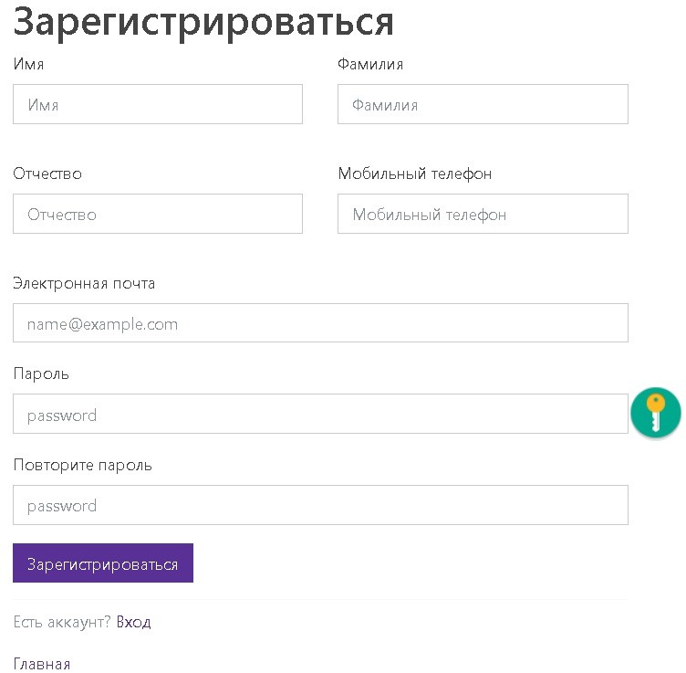
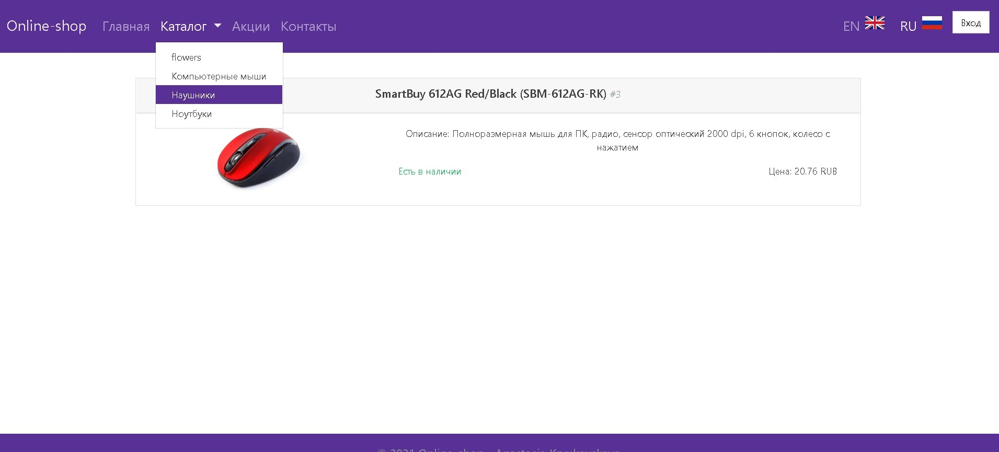
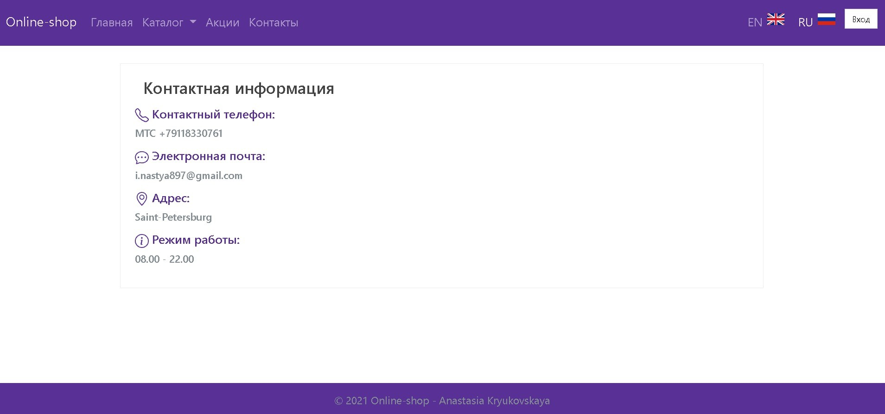
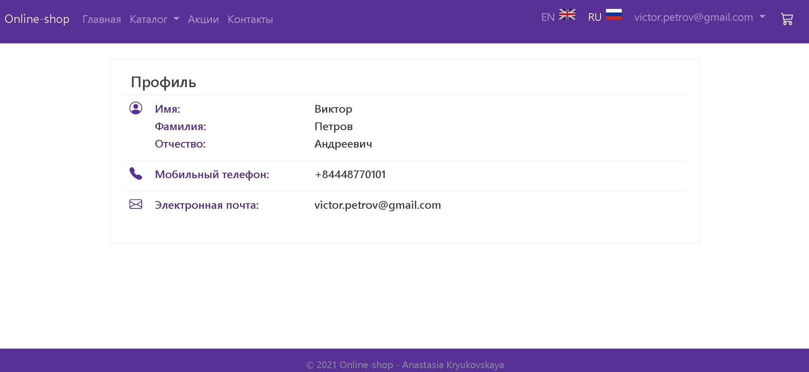
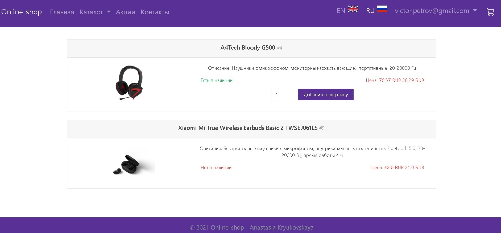
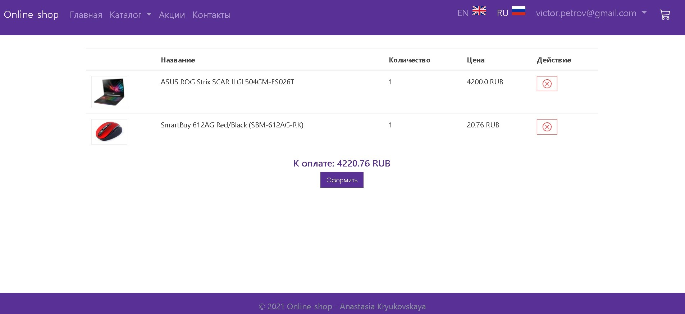
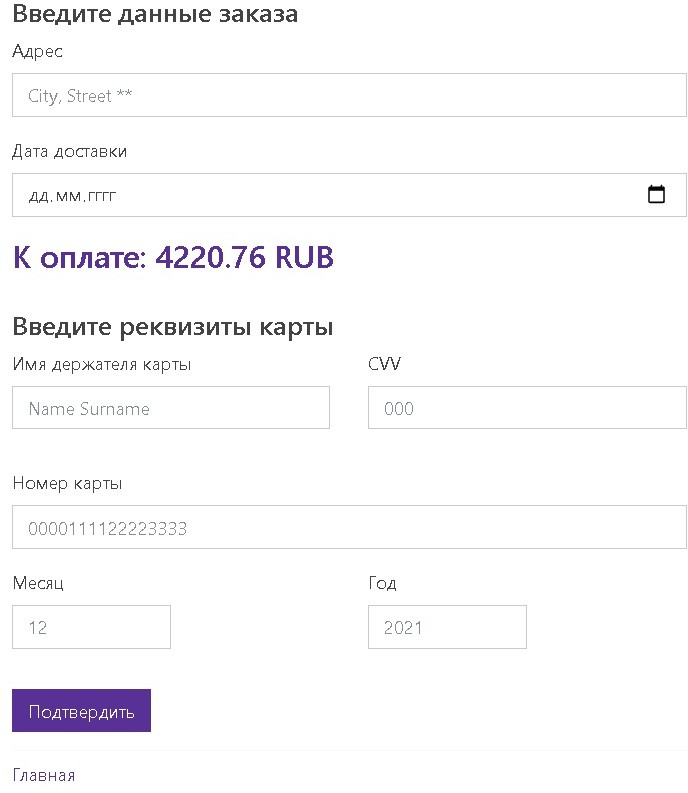
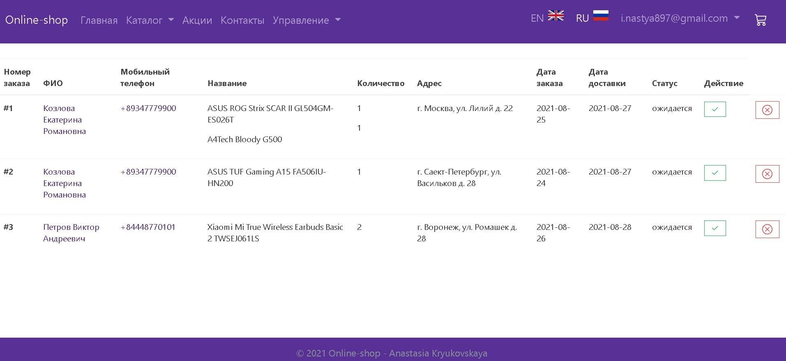
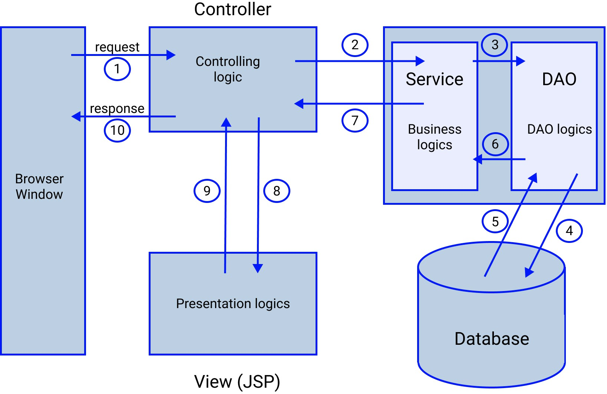

# Online-shop

## Оглавление

1. [Назначение программы](#Назначение-программы)
2. [Пользовательский интерфейс](#Пользовательский-интерфейс)
3. [Описание архитектуры программы](#Описание-архитектуры-программы)
4. [Описание наиболее важных компонентов программы](#Описание-наиболее-важных-компонентов-программы)
    

[:arrow_up:Оглавление](#Оглавление)
___
## Назначение программы

Приложение отображает web каталог магазина, который позволяет не только просмотреть товары, но и купить их. В приложении также предусмотрена иерархическая система: обычный пользователь, авторизированный пользователь и администратор, каждый из которых имеет свои возможности. Данное приложение реализовано на языке программирования java. При разработке использованы: JSP, Servlet, JAVA, bootstrap, MySQL, JDBC. В данной версии программы реализованы следующие возможности:

Для обычного пользователя:

-	просмотр главной страницы;
-	просмотр товаров по категориям;
-	просмотр акций магазина;
-	возможность пройти регистрацию для получения статуса авторизированного пользователя;
-	просмотр контактной информации о магазине;

Для авторизированного пользователя пользователя к вышеперечисленным функ- циям добавляется:

-	добавление товаров в корзину;
-	просмотр страницы своего профиля;
-	удаление товаров из корзины;
-	просмотр страницы своих заказов с указанием статуса (ожидается / получен);
-	возможность оформить заказ из собранной корзины;
-	выйти из системы;

Для администратора к вышеперечисленным функциям добавляется:

-	создание товара на сайте (загрузка фото, пометка о наличии товара, добав- ление акции к товару, цены и комментарий);
-	редактирование параметров существующего товара;
-	создание новой акции с указанием ее срока действия, фотография ации, ука- зание процента скидки и комментарий;
-	создание новой категории товаров;
-	отслеживание всех существующих заказов от пользователей с возможностью изменения статуса заказа;

____
[:arrow_up:Оглавление](#Оглавление)
____
## Пользовательский интерфейс

Главная страница:

Страница регистрации:

Страница всех акций:

Страница товаров из категории Компьютерные мыши:

Страница контактной информации:

Страница профиля авторизированного пользователя:

Страница товаров для авторизированного пользователя:

Корзина продуктов:

Оформление заказа:

Страница отслеживания всех пользовательских заказов:

    
[:arrow_up:Оглавление](#Оглавление)
____
## Описание архитектуры программы
   
На рисунке выше приведена архитектура программы и цифрами обозначено перемещение пользовательского запроса между наиболее значимыми частями архитектуры программы.
 
После отправления запроса пользователем он попадает в Controller, где полученный запрос разбирается на переданные с ним параметры, атрибуты и атрибуты сессии. По параметру command Controller принимает решение, на сервис, какой сущности передать запрос. В модуле Service, для осуществления нашего действия передаем запрос в DAO, для получения информации. А DAO в свою очередь получает информацию напрямую из БД.

В БД начинается движение обратно, полученные данные передаются в DAO, которое преобразует эти данные, в сущности (объекты) программы, затем полученные сущности попадают в Service, который осуществляет логику относительно переданной команды с данными. После, результат работы попадает в Controller, где реакция на пользовательскую команду отображается на JSP странице, которая в свою очередь отобразится в окне браузера пользователя.

    
[:arrow_up:Оглавление](#Оглавление)
___
## Описание наиболее важных компонентов программы

Вся программа разделена на основные компоненты, которые взаимодействуют между собой:

- Controller

Данный модуль занимается обработкой действий пользователя. Любые действия пользователя, направленные на изменения модели, должны обрабатываться тут.

- DAO

Данный модуль отвечает за работу приложения с базой данных (передачу запросов в БД и обработку полученных от неё ответов).

- Entity

Данный модуль отвечает за сущности, некие реальные объекты нашего интернет-магазина, которые будут иметь свои атрибуты. Например: наш объект – пользователь, а его атрибутами будут являться: id пользователя, id информации о пользователе, его логин, пароль и роль на данном сайте (обычный покупатель / администратор).

- Exception

Обработка исключений для модулей Controller, DAO и Service.

- Service

Содержит бизнес-логику приложения.

[:arrow_up:Оглавление](#Оглавление)